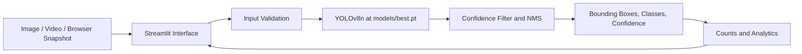

# Deep Learning Based Recycling Object Detection System

## 1. Abstract

This project prepares a TACO-derived object-detection dataset, trains and compares YOLOv8 models, and provides a Streamlit prototype for detecting plastic, glass, paper, metal, and cardboard in images, videos, and browser-captured frames. The selected checkpoint is the Phase 3 YOLOv8n baseline. Its supplied held-out test metrics are precision 23.31%, recall 24.23%, mAP@0.5 21.11%, and mAP@0.5:0.95 14.19%. These are benchmark metrics, not real-world accuracy claims. The dataset is small and imbalanced, especially for cardboard, so the system remains a research prototype.

## 2. Introduction

Recyclable items appear in varied environments, lighting, orientations, and states of occlusion. Object detection can localize visible items and assign broad material categories, supporting demonstrations and research into automated sorting. This project uses a prepared object-level subset of TACO and a YOLOv8 detector, then exposes predictions through a Streamlit interface.

## 3. Problem Statement

Manual material sorting can be slow and inconsistent. The project explores whether an object detector can mark visible items in user-provided media and classify them into five material categories. A detector's predictions do not determine contamination, local recycling rules, or whether an object should be accepted by a specific recycling program.

## 4. Objectives

- Prepare a reproducible, object-annotated dataset using a fixed five-class ontology.
- Train and evaluate a pretrained YOLOv8 model on a held-out split.
- Compare a small number of model/training variants and retain the baseline with the strongest overall mAP among those experiments.
- Build a Streamlit application for image, video, and browser-captured frame inference.
- Report model limitations and testing outcomes without inventing data or deployment results.

## 5. Existing System

Manual sorting and visual inspection rely on human judgment and are not automated detection systems. This report does not claim a measured comparison against industrial sorting equipment or another published model. The project's baseline is evaluated only on its own prepared test split.

## 6. Proposed System

The proposed prototype accepts an image, video, or one browser-captured camera frame; validates and decodes the media; runs the selected YOLOv8n checkpoint; and displays bounding boxes, class names, confidence values, counts, and summaries. CUDA is selected when available, otherwise inference uses CPU. Video inference samples frames and does not track unique objects over time.

## 7. System Architecture



Implementation responsibilities are divided among `app.py`, `src/detection.py`, `src/video.py`, `src/utils.py`, and `src/analytics.py`. The application details are documented in [PHASE4_APP.md](PHASE4_APP.md).

## 8. Dataset

The dataset is a curated, TACO-derived object-detection subset:

| Split | Images | Annotated objects |
|---|---:|---:|
| Train | 477 | 992 |
| Validation | 96 | 197 |
| Test | 64 | 169 |
| **Total** | **637** | **1,358** |

The per-class object totals are plastic 893, metal 302, paper 87, glass 53, and cardboard 23. The data is strongly class-imbalanced. In particular, there is only one cardboard object in the test split.

## 9. Dataset Preparation

The dataset preparation script maps explicit source categories conservatively, converts existing COCO bounding boxes to normalized YOLO labels, and splits images by image using seed 42. Six out-of-bounds source boxes were skipped; no boxes were fabricated. The recorded quality checks found zero corrupt images, zero exact duplicates, ten near-duplicate hash groups kept together, no cross-split near-duplicate candidates, and validation with zero errors and warnings. Prepared annotation examples were visually spot-checked. TACO does not provide capture-sequence grouping in the metadata used here.

The project selects TACO records with a missing image-license field based on the source terms documented in the dataset report. Source/license notes are in `dataset/source_manifest.csv` and `dataset/DATASET_REPORT.md`.

## 10. Class Mapping

| Class ID | Name | Object count |
|---:|---|---:|
| 0 | plastic | 893 |
| 1 | glass | 53 |
| 2 | paper | 87 |
| 3 | metal | 302 |
| 4 | cardboard | 23 |

The class order is fixed in `config/config.py`, the dataset configuration, and the model checkpoint. No additional classes are introduced by the application.

## 11. Methodology

The selected training run used pretrained YOLOv8n transfer learning, a 640-pixel image size, 50 epochs, and seed 42 on a Colab T4 GPU. The test split was held out for evaluation. The Phase 3.5 experiments are comparison runs and did not replace the selected baseline. The original local Windows training preflight was blocked by missing local training dependencies and GPU; that historical failure is distinguished from the supplied completed Colab run in [TRAINING_REPORT.md](TRAINING_REPORT.md).

## 12. Model Training

The selected Phase 3 model is the YOLOv8n 50-epoch baseline stored at `models/best.pt`. Its project file is 6,238,762 bytes and the model loaded successfully during Phase 5 validation. No new training was performed for Phase 4 or Phase 5, and the checkpoint was not modified.

## 13. Model Evaluation

The supplied Phase 3 test-set metrics are:

| Metric | Test result |
|---|---:|
| Precision | 23.31% |
| Recall | 24.23% |
| mAP@0.5 | 21.11% |
| mAP@0.5:0.95 | 14.19% |

These metrics describe the reported held-out benchmark evaluation only. They are not real-world accuracy estimates or guarantees. The one cardboard test object is not enough to support reliable cardboard performance conclusions.

## 14. Phase 3.5 Model Comparison

| Experiment | Precision | Recall | Test mAP@0.5 | Test mAP@0.5:0.95 |
|---|---:|---:|---:|---:|
| Phase 3 YOLOv8n, 50 epochs (selected) | 23.31% | 24.23% | 21.11% | 14.19% |
| YOLOv8s | 22.24% | 22.33% | 20.16% | 11.09% |
| YOLOv8n, 100 epochs | 33.25% | 17.05% | 17.17% | 9.25% |

The 100-epoch YOLOv8n experiment had higher precision but lower recall and both mAP measures than the selected baseline. The baseline had the strongest overall mAP results among the documented experiments and remains the application model.

## 15. Application Development

The Streamlit app uses a project-relative model path and caches model loading. It automatically chooses CUDA when available and falls back to CPU. Missing or unloadable weights, invalid images, and unsupported/unreadable videos produce user-facing errors. The Streamlit interface has Dashboard, Image Detection, Video Detection, Webcam, Analytics, and About navigation.

## 16. Application Features

- Image uploads in JPG, JPEG, PNG, and WEBP formats, with annotated output and class/confidence/coordinate details.
- MP4, AVI, and MOV processing in sequential frames, with selectable frame interval and downloadable annotated MP4 output.
- Browser webcam snapshot input using Streamlit's camera control; continuous live inference is not implemented.
- Confidence threshold range 0.05–0.95, default 0.25, passed directly to YOLO inference.
- Per-class counts, total detections, unique detected classes, observed category share, and highest-count category based on actual predictions.
- Phase 3 test benchmark metrics and Phase 3.5 comparison results, labeled separately from runtime predictions.

Video totals are detections across sampled frames, not unique physical objects. The same visible item may count again in a later sampled frame.

## 17. Testing

Phase 5 checks included Python syntax compilation, project module imports, model path/readability and real checkpoint loading, exact model/application class order, one real CPU inference on a Phase 2 test image, confidence/count/annotation unit checks, invalid image/video handling, and empty detections. A temporary four-frame MP4 with a deterministic fake detector checked sequential video processing, threshold propagation, output decoding, and invalid-video errors; it was a functional fixture, not a model evaluation. The Streamlit server health endpoint and all six pages rendered through Streamlit's test harness. Webcam capture was not tested because no browser camera hardware/session was available. Details and statuses are in [FINAL_TEST_REPORT.md](FINAL_TEST_REPORT.md).

## 18. Results

The reported Phase 3 benchmark metrics and Phase 3.5 comparison numbers are listed above. During a separate smoke check, the selected checkpoint loaded on CPU and produced seven detections on one test image at confidence 0.25. That single-image smoke check is not representative performance evidence and is not a replacement for the Phase 3 test evaluation. The temporary video fixture checked the media-processing path only.

## 19. Limitations

1. The dataset is small compared with the diversity of real recycling environments.
2. Class frequencies are strongly imbalanced.
3. Cardboard has only 23 labeled objects overall and one test object.
4. Minority-class performance, especially cardboard, is unreliable to evaluate.
5. Baseline benchmark performance is limited; it is not production-grade.
6. Test-set metrics are not real-world accuracy claims.
7. Lighting, backgrounds, occlusion, object scale, and material variation may change predictions.
8. The application performs object detection/classification only; it does not physically sort waste or determine local disposal rules.
9. Video counts are frame detections and do not track unique objects.
10. Webcam capture depends on browser permissions and the Streamlit host; only snapshot input is implemented.
11. CPU video inference may be slow, and video codec support varies by runtime.

## 20. Future Scope

Future work could collect a larger and more balanced dataset with additional real-world examples, improve and audit labels, test stronger augmentation and class balancing, tune hyperparameters, and evaluate larger YOLO models under controlled conditions. Additional engineering options include video tracking, a continuous real-time camera pipeline, edge-device deployment, smart-bin and IoT monitoring, cloud hosting, and robotic sorting-arm integration. These are proposals, not completed project features.

## 21. Conclusion

The project provides a complete research prototype spanning dataset preparation, a selected YOLOv8n baseline, model comparisons, and a Streamlit interface. The benchmark results and dataset limitations are documented, and Phase 5 smoke checks verified key application paths on CPU. Broader real-world evaluation and reliable minority-class performance remain open work.

## 22. Technologies Used

- Python
- Ultralytics YOLOv8 and PyTorch
- Streamlit
- OpenCV and NumPy
- Pillow and pandas
- YAML configuration for dataset/training tools
- TACO-derived COCO object annotations converted to YOLO format

## 23. How to Run

From the project root, with `models/best.pt` present:

```bash
python -m pip install -r requirements.txt
streamlit run app.py
```

For optional automated core checks:

```bash
python -m unittest discover -s tests -v
```
