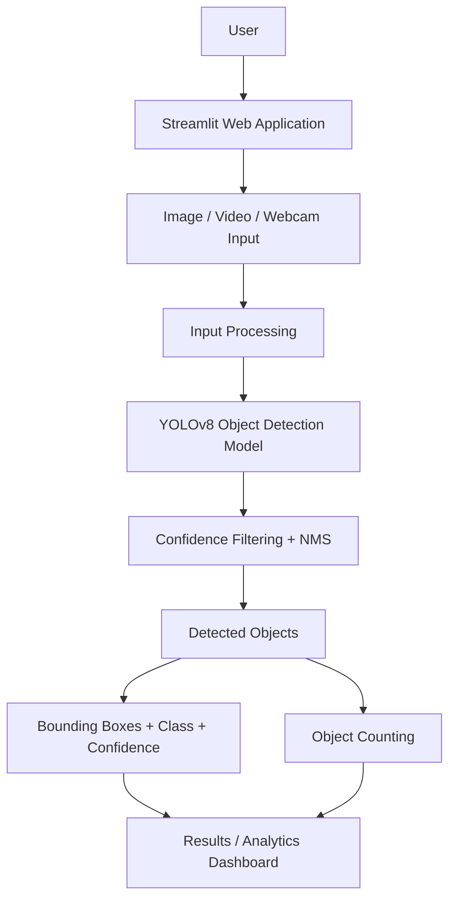
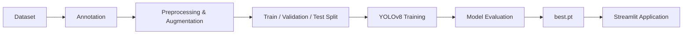
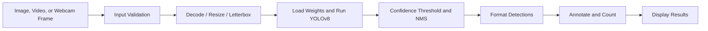

# System Architecture

## High-level architecture

The application is implemented as a Streamlit front end connected to input handling, YOLOv8 inference, post-processing, counting, and a results/analytics view. Working module details are in [PHASE4_APP.md](PHASE4_APP.md).

## Training architecture

Training is a separate offline workflow. Dataset preparation and model training are complete for the documented baseline; this diagram shows the project lifecycle.

## Inference architecture

## Component responsibilities

| Component | Responsibility |
|---|---|
| User interface (`app.py`) | Streamlit pages for image, video, and webcam snapshot input, settings, and result display. |
| Input processing (`src/utils.py`, `src/video.py`) | Validate/decode images, copy video uploads to temporary storage, and process frames sequentially. |
| Detection (`src/detection.py`) | Load `models/best.pt`, select CUDA or CPU, run inference, and expose boxes, fixed class IDs, and confidence values. |
| Post-processing (`src/detection.py`) | Pass confidence to YOLO inference and format retained detections; YOLO handles its built-in NMS. |
| Analytics (`src/analytics.py`) | Aggregate total and class-wise counts and confidence summaries for processed inputs. |
| Training (`scripts/train.py`) | Separate training workflow; historical local preflight and completed Colab baseline are documented in the final report. |
| Evaluation (`scripts/evaluate.py`) | Separate held-out evaluation workflow. Reported Phase 3 metrics are documented in the final report. |
| Configuration (`config/config.py`, `dataset/data.yaml`) | Keep class names, default thresholds, paths, and dataset class mapping in one place. |

## Data flow

1. The user selects an image, a video, or webcam snapshot in the Streamlit interface.
2. Input processing validates and decodes the content. Videos are handled as a sequence of frames.
3. Frames are converted/resized to the input format expected by the selected Ultralytics model; letterboxing should preserve aspect ratio as appropriate.
4. YOLOv8 produces candidate boxes, class scores, and confidence values. Detector inference includes its configured post-processing/NMS behavior.
5. The application applies the selected confidence threshold and formats retained detections.
6. Counts and confidence summaries are calculated for the image or processed frame and presented with annotated output.

For video, detections are accumulated across sampled inference frames and boxes are repeated over intervening frames. A tracking component and explicit counting policy are required to report unique objects across time.

## Model flow

The selected model has five output classes, with IDs 0–4 ordered as plastic, glass, paper, metal, and cardboard. Its checkpoint is stored at the project-relative path `models/best.pt`.

The dataset YAML uses Ultralytics-style split paths. Bounding-box label files must use the format expected by the chosen Ultralytics training workflow. The dataset split and class mapping must be verified before training.

## Input and output description

| Stage | Input | Output |
|---|---|---|
| UI | User-selected image, video, or camera source | Encoded file or camera frames |
| Input processing | Encoded input/frame | Decoded and model-ready frame |
| Detection | Model-ready frame and compatible weights | Candidate box coordinates, class IDs, confidence scores |
| Post-processing | Candidate detections and thresholds | Retained, formatted detections |
| Analytics | Formatted detections | Total count, class-wise counts, confidence statistics |
| Presentation | Annotated frame and summaries | Visual results and detection summary |

This document preserves the original architecture design and records the current implementation mapping above.
